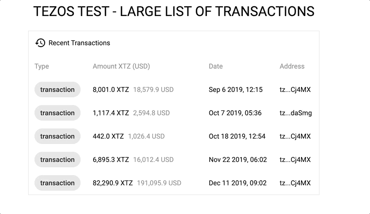

# Tezos Test - Transactions Table

This is an Angular application to show operations provided by [tzstats API](https://tzstats.com/docs/api/index.html#operation-table) to show transactions in a table with virtual scroll and infinite scroll.

This is a standard Angular CLI application, so the steps to build, run, test and e2e are the normal ones, please read on to see more information about it.





# How to run locally

1. Clone this repository and install dependencies using `npm install` inside the cloned folder
2. Run the local development server using `npm start` _(watch mode enabled)_
6. Open [localhost:4200](http://localhost:4200)


# How to run tests

To run unit tests: ```npm run test```

To run end to end tests: ```npm run e2e```

<i>Make sure to have chrome driver version aligned with chrome version.</i>

<i>vscode debug configuration added to debug</i>
